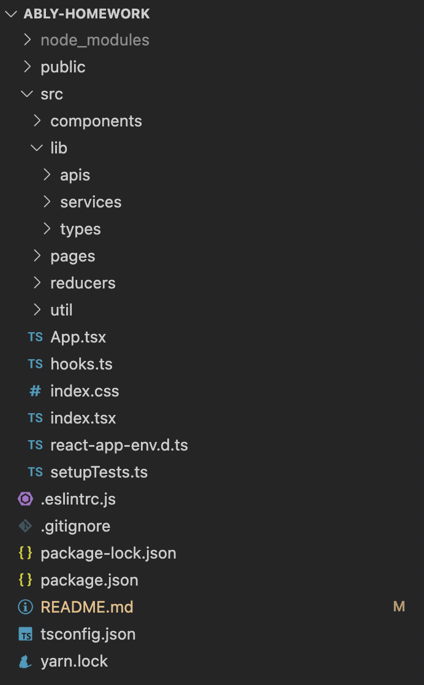
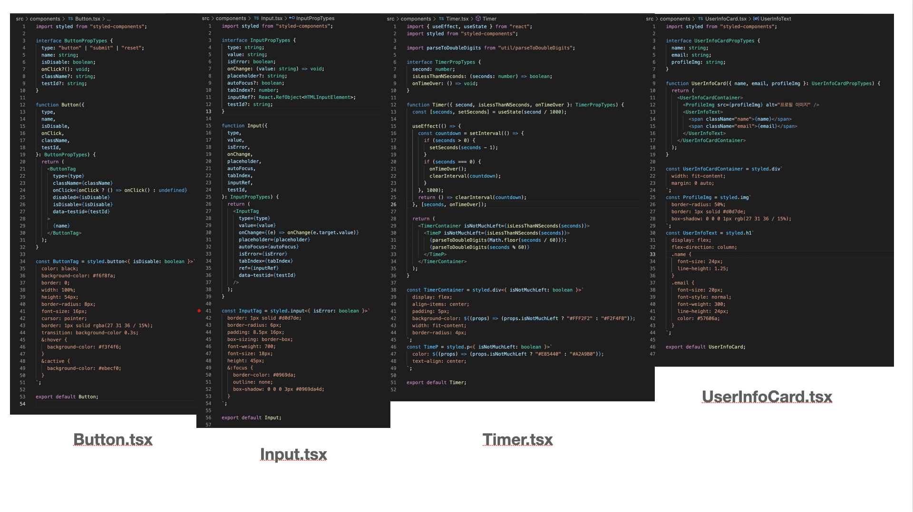
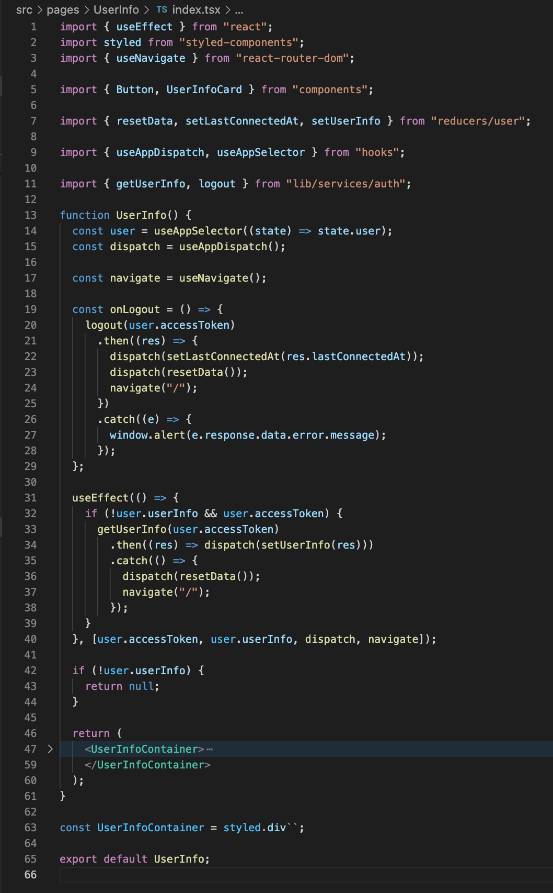

# 에이블리 사전과제

안녕하세요!

3월 29일부터 에이블리 프론트엔드 엔지니어 포지션의 사전과제를 진행한 조웅연입니다.

## 프로젝트 실행 방법

1. `yarn` 명령어를 이용해서 실행에 필요한 패키지를 설치합니다.
2. `yarn start` 명령어를 이용해서 애플리케이션을 실행시킵니다.

## 주 사용 라이브러리와 사용 의도

### axios

http api 연동을 위해 사용하였습니다.

### react-router-dom

페이지별로 라우팅을 하기위해 사용하였습니다.

### @reduxjs/toolkit

상태 관리 로직을 빠르게 작성할 수 있기 때문에 사용하였습니다.

### redux-persist

store에서 관리되는 데이터들을 localStorage와 쉽게 연동하기 위해 사용하였습니다.

상태값을 영구히 보관하기 위해서 사용하였습니다.

### styled-components

- css 파일을 줄이고
- 동적 스타일링을 쉽게 구현하고
- 스타일 스코프에 신경을 덜 쓸수 있기 때문에

사용하였습니다.

## 프로젝트 폴더 구조와 설계 의도

### App.tsx

페이지 라우팅이 있는 파일입니다.

### hooks.ts

프로젝트 내에서 유용하게 사용되는 hook이 들어있는 파일입니다.

문서 작성 시점으로 현재는 store에 쉽게 접근할 수 있게 만드는 훅들이 있습니다.

### index.tsx

redux의 provider로 App을 감싸서 렌더링하는 코드가 있는 파일입니다.

앱에 대한 전체적인 설정은 이 파일에서 이뤄집니다.

### src/components

앱 내에서 공통적으로 사용되는 **UI 요소**들을 컴포넌트화 한 파일들이 있는 디렉토리입니다.

### src/lib

앱 내에서 공통적으로 사용되는 재료 성격의 파일들이 있는 디렉토리입니다.

문서를 작성하는 현재 시점으로는

- axios instance들이 있는 **apis**
- api 호출 함수들이 있는 **services**
- 타입을 정의한 파일들이 있는 **types**

가 있습니다.

### src/pages

container 성격의 컴포넌트들이 있는 디렉토리입니다.

이 디렉토리에 있는 컴포넌트는 페이지로써 사용됩니다.

### src/reducers

리듀서와 리듀서를 합쳐 store를 만들어주는 파일들이 있는 디렉토리입니다.

### src/util

공통적으로 사용되는 타입스크립트 로직 파일들이 있는 디렉토리입니다.

## 컴포넌트 구조와 설계 의도

현재 이 프로젝트에 존재하는 컴포넌트는 크게 두가지 유형으로 나눌 수 있습니다.

UI 표현을 담당하는 컴포넌트들이 있는 src/components

페이지를 구성하는 컴포넌트들이 있는 src/pages

### src/components

src/components에 있는 컴포넌트들은 공통적으로

- propstype 선언부
- 컴포넌트 함수 선언부
- styled-components 요소 선언부

이런 순서로 파일이 구성되어 있습니다.

컴포넌트 함수는 대부분 단순히 jsx만 리턴하고 있습니다. (Timer 제외)

### src/pages

src/pages에 있는 컴포넌트들은 container 컴포넌트의 성격을 띱니다.

위 사진처럼 src/pages에 있는 컴포넌트들은

UI에 관련된 컴포넌트들에 상태값을 연결하고, 페이지를 이동하는 등의 작업을 해야하기 때문에 동작에 관련된

- selector, dispatch 선언
- navigate 함수 선언
- useEffect 코드
- jsx에 사용되는 함수

이러한 코드들이 존재하게 됩니다.

## 상태 관리의 구조와 설계 의도

기본적으로 상태의 성격별로 리듀서를 구성했습니다.

### auth

인증에 관련된 상태값들이 처리되는 리듀서입니다.

### user

유저 정보에 관련된 상태값들이 처리되는 리듀서입니다.

## 강조하고 싶은 부분 또는 그 외 기타 내용

이번 프로젝트를 진행하며 아래의 내용들을 중요하게 생각했습니다.

- 과도하게 분리한다고 생각이 들어도, 나중에 바뀔 가능성이 있다고 판단되면 별도 파일로 분리할 것
- 같은 유형이지만 다른 파일들이 생길 가능성이 있다고 판단되면, 해당 유형의 파일을 합치는 디렉토리를 만들어서 관리할 것
- jsx에 css나 javascript 코드 덩어리를 없게 하여 구조 파악에 집중할 수 있는 jsx를 구성할 것
